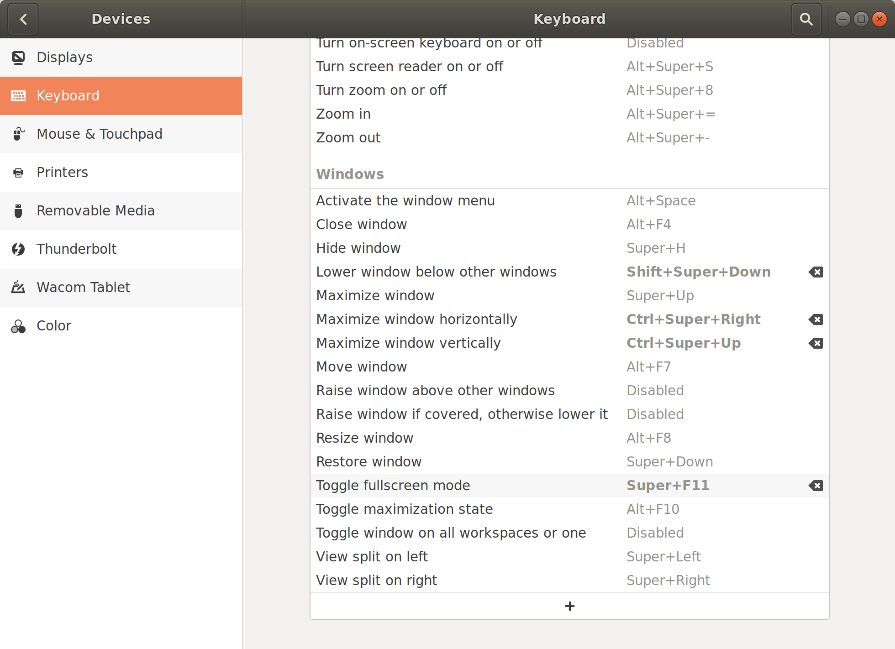

# Arrow Projection for Robot Navigation Path

This repository contains code for the HRI 2022 Short Contributions paper: "**Projecting Robot Navigation Paths: Hardware and Software for Projected AR**".

Paper website: [https://inside.mines.edu/~zhaohan/#hri2022b](https://inside.mines.edu/~zhaohan/#hri2022b).

This package was tested with ROS Melodic on Ubuntu 18.04.

It is recommended to read the [4-page paper](https://inside.mines.edu/~zhaohan/hri22-nav-paths-projection/hri22-nav-paths-projection-hardware-software-projected-AR.pdf) to get an overview.

## Hardware Requirement

- Robot with ROS support (e.g., [Fetch](https://docs.fetchrobotics.com/))
- Projector (e.g., [ViewSonic PA503W](https://www.viewsonic.com/us/pa503w.html). If out-of-stock, you can buy it on Amazon.)
  - If another projector is used, please go to the second last section to make needed changes. i.e., BYOP (Bring your own projector).
- Portable power station (e.g., [Aeiusny-branded on Amazon](https://www.amazon.com/dp/B095P7QX3G/))

## Software Requirement

- Ubuntu 18.04 ([Official ROS wiki page](https://ubuntu.com/tutorials/install-ubuntu-desktop#1-overview))
- ROS Melodic ([Install instruction](https://wiki.ros.org/melodic/Installation/Ubuntu))
- A catkin workspace ([Official ROS tutorial](http://wiki.ros.org/catkin/Tutorials/create_a_workspace))

## Setup

### rviz

Download rviz to your `src` directory: 

    git clone https://github.com/ros-visualization/rviz -b melodic-devel

Check out the file `arrow_marker.cpp.diff` to specify some of the arrow parameters.

### rviz_camera_stream

Download the rviz plugin `rviz_camera_stream` to your `src` directory: 

    git clone https://github.com/uml-robotics/rviz_camera_stream

### Download the code

Download `arrow_projection_ROS_package.zip` and extract the folder inside to your `src` folder.

This should just be a `git clone` command once we move the code to GitHub.

### Add full-screen keyboard shortcut

On Ubuntu, enable a "Toggle fullscreen mode" shortcut `Super - Shift - F11` in keyboard settings:

## Running

Most of the programs can be run on dev computer, but we run all of them on the robot's onboard computer. We'll clarify if it has to be run on the robot.

### ROS navigation stack

Because we need to subscribe to the global navigation path, we need to run the navigation stack.

For the Fetch robot, please read the official navigation documentation: http://docs.fetchrobotics.com/navigation.html

### Before launching path projection node

    roslaunch arrow_projection arrow_projection.launch

This will launch both `camera_publisher.launch` (so rviz knows the calibration profile of the projector) and `launch/tf_publisher.launch` (this contains the pose of where the projector is mounted).

### Run path projection node

    rosrun arrow_projection path_projection_node

### Rviz

    roscd arrow_projection && rosrun rviz rviz -d rviz/path_projection.rviz

### image viewer

Because we will output a 2D image to the projector mounted on the robot through HDMI, the image view needs to be run on the onboard computer.

We have enabled remote desktop in Ubuntu on the robot. There is an official tutorial on how to [enable](https://help.ubuntu.com/stable/ubuntu-help/sharing-desktop.html.en) and [access](https://ubuntu.com/tutorials/access-remote-desktop) remote desktop.

    rosrun image_view image_view image:=/projector/image

Then press `Super - Shift - F11` to make it full screen without window chrome.

## Generalizable Reference API

As seen in the paper, although this code is mainly arrow projection, we have also provided how to project a destination circle. As stated in the paper, any visualization in Rviz can be projected. 

We encourage you to take a look at the `create_destination_sphere_marker` function in `src/PathProjection.cpp` for the destination circle code. In the same file, please take a look at `create_arrow_marker` for how an arrow is created and line 118 - 122 for a for loop to create all the arrow.

## BYOP (Bring your own projector)

If you bought another projector, 2 changes should be made.

1. Change the parameter in `tf_publisher.launch`. If your mount the projector at a fixed position, only 1 `static_transform_publisher` is needed. This official ROS documentation has everything you needed: http://wiki.ros.org/static_transform_publisher.
2. Please calibrate the projector lens according to the paper and change `projector_camera_info.yaml`.

## Contact

Feel free to open a GitHub issue for any questions.
